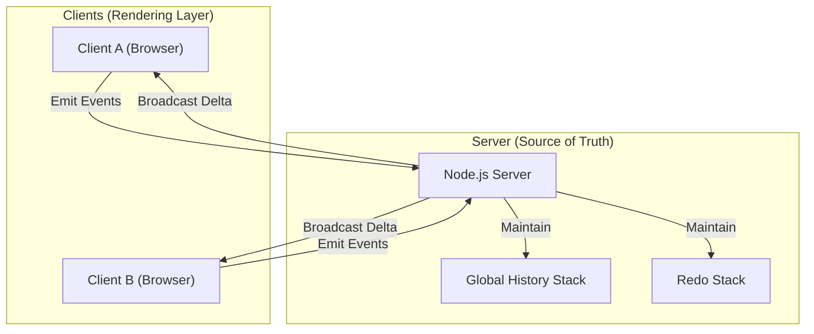

# 🎨 Collaborative Drawing Architecture

## 1. System Overview

This project is a real-time, multi-user drawing application based on a **Client–Server Architecture**. It uses **WebSockets** for bi-directional communication and a **Centralized State Management Pattern** to maintain a consistent drawing state across all connected clients.

The server acts as the **single source of truth**, while clients are responsible for rendering the state provided by the server.

---

## 🏛 High-Level Architecture Diagram

The system follows a **“Thin Client, Fat Server”** model:

- **Client:** UI rendering, input capture (Mouse/Touch), and optimistic updates.
- **Server:** State management, synchronization, and conflict resolution.



---

## 2. Data Flow & Synchronization Strategy

### A. The **Stroke** Data Model (Vector Storage)

Instead of sending bitmap pixel data, the application transmits **vector paths**. Each drawing action is represented as a **Stroke** object.

```json
{
  "id": "k9...z1",
  "userId": "socket_id_123",
  "color": "#FF0000",
  "size": 5,
  "points": [
    { "x": 100, "y": 100 },
    { "x": 105, "y": 102 }
  ]
}
```

### B. Event Protocol (Optimized for Delta Updates)

We use a custom WebSocket protocol designed to minimize bandwidth by sending "Deltas" (changes) rather than the entire history.

| Event Name      | Direction       | Payload              | Purpose                                                              |
| --------------- | --------------- | -------------------- | -------------------------------------------------------------------- |
| `connection`    | Client → Server | –                    | Establishes the socket connection.                                   |
| `new-user`      | Client → Server | `String` (Name)      | Registers the user and assigns a unique color.                       |
| `drawing-live`  | Bidirectional   | `{ x0, y0, x1, y1 }` | Streams temporary movement for real-time preview. Not saved.         |
| `drawing-save`  | Client → Server | `Stroke Object`      | Finalized stroke sent on mouseup.                                    |
| `new-stroke`    | Server → Client | `Stroke Object`      | **Delta Update:** Broadcasts _only_ the new stroke to other clients. |
| `undo` / `redo` | Client → Server | –                    | Requests a state change.                                             |
| `delete-stroke` | Server → Client | `String` (StrokeID)  | **Delta Update:** Instructs clients to remove a specific stroke.     |
| `cursor-move`   | Bidirectional   | `{ id, x, y }`       | Syncs ghost cursors of other users.                                  |

---

## 3. State Management (User-Specific Undo)

We utilize a **Smart Undo Strategy** that differentiates between users, ensuring one user does not accidentally undo another's work.

### Logic Flow:

1. **User Action:** User clicks **Undo**.
2. **Server Lookup:** The server scans the `drawingHistory` array backwards to find the most recent stroke created by **that specific user** (matching `socket.id`).
3. **State Change:** The server removes that specific stroke and pushes it to the `redoStack`.
4. **Delta Broadcast:** Instead of resending the whole history, the server emits `delete-stroke` with the specific ID.
5. **Client Update:** Clients filter that ID out of their local history and repaint.

---

## 4. Conflict Resolution & Concurrency

1. **Sequential Processing:** Node.js processes events sequentially (Single Threaded). The server defines the absolute order of strokes.
2. **Redo Clearing:** If a user draws a new line, the `redoStack` is cleared to prevent history conflicts (Timeline branching).

---

## 5. Design Principle

> **Clients render. Server decides. History is absolute.**
